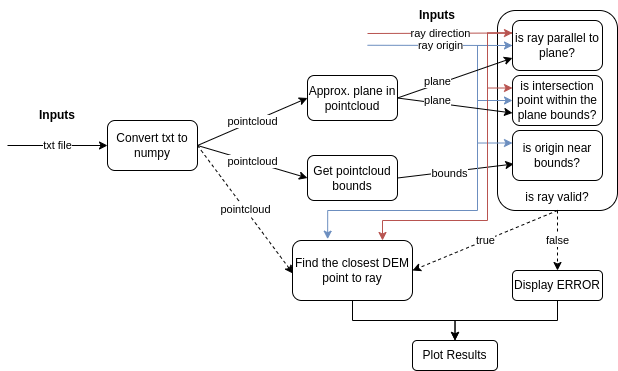

# Drone-Based Terrain Mapping
## Coding challenge
You are provided with a Digital Elevation Model (DEM) in ASCII format (dem.txt). This DEM represents a square area of 1 km by 1 km, with a spatial resolution of 1 meter per pixel (1m x 1m). Each line in the file contains space-separated x, y, and z coordinates, using UTM coordinates in the ETRS89 coordinate reference system (EPSG 25832).

Develop a program that accepts six command-line arguments: three representing an origin point (x, y, z) and three representing a direction vector (vx, vy, vz) of a three-dimensional ray.

## Requirements
* The program should calculate the intersection of this ray with the DEM plane and identify the closest point on the DEM to the ray.
* Ensure the program operates with reasonable performance. Consider using efficient data structures.
* Include input validation to ensure the provided values are within the expected range and to check if the ray can potentially intersect with the DEM.
* Output the x, y, and z coordinates of the closest intersection point to the console.

## Implementation
The solution for the intersection problem can be breaking down into 10 main blocks as the figure bellow describes.



1. Convert txt to numpy 
    * Uses `numpy.genfromtxt` method to efficeintly read the txt file and store the DEM data.
2. Approximate plane in pointcloud
    * Uses Principal Component Analysis (PCA) to fit a plane in pointcloud by finding the plane equation coefficients that satisfy equation.
    $$ ax+by+cz+d=0 $$ 
3. Get pointcloud bounds
    * Computes the $min$ and $max$ values considering all $x,y,z$ values of pointcloud.
4. Is origin near bounds?
    * Calculates the Euclidean distance to the closest point on the pointcloud boundary and it returns true if the closest distance is within certain threshold, false otherwise.
5. Is ray parallel to plane?
    * Given that a plane in 3D space can be described by the equation $ ax+by+cz+d=0 $, where $a,b,c,d$ are the plane coefficients. And a ray can be described by the equations:
        $$\begin{cases}
        x = x_0 + t \cdot v_x \\
        y = y_0 + t \cdot v_y \\
        z = z_0 + t \cdot v_z
        \end{cases}
        $$
        where $x_0, y_0, z_0$ is the origin of the ray, $v_x,v_y,v_z$ is the direction vector of the ray, and $t$ the parameter to find.

        If we substitute the equations of the ray into the plane equation and we solve for $t$ we obtain:

        $$t = \frac{-(a x_0 + b y_0 + c z_0 + d)}{a v_x + b v_y + c v_z}$$
        being $D$ the denominator of the equation express as $D=a v_x + b v_y + c v_z$ 

        Now, by analysing the denominator $D$ we could know if the ray is parallel or not to the plane. **If $D=0$, then the ray is parallel and does not intersect the plane.**
6. Is intersection point withing the plane bounds?
    * By substituting the $t$ parameter in the previously described ray equations, we obtain the **intersection point** between the ray and the approximated plane. If this point lies within the point cloud limits, the function returns true, otherwise, it returns false.
7. Is ray valid?
    * If methods $4,5,6$ return true, this function returns true as well. 
8. Find the closest DEM point to ray
    * First, we normalize the direction vector and generate a set of points along the ray direction. Second, we build a KDTree for the DEM points to efficiently search the closest to the intersection. Finally, we search in the tree and return the DEM point that is closest to the intersection.
9. Display ERROR
    * Displays the errors that we might encounter, for example, ray parallel to the plane, origin out of range, etc.
10. Plot Results
    * If the visualization flag is set to true, the method displays the point cloud, the ray, the plane approximation, and the closest DEM point to the intersection.

## How to run?


First, ensure that you have installed the required libraries listed in `requirements.txt`. If you encounter any issues, make sure you have the correct versions installed. It is recommended to create a virtual environment (Python 3.8.10).

If desired, you can install the libraries with the correct versions by running the following command:
```
pip3 install -r requirements.txt
```

Next, open a terminal from the directory where you have cloned the repository and run the `intersection.py` file, passing the parameters for the ray origin $(x,y,z)$ and ray direction $(v_x, v_y, v_z)$, following the format shown below:
```
python3 intersection.py <x> <y> <z> <vx> <vy> <vz>
```

The visualization results are enable by default, if you want to disable them go to the `intersection.py` file and change the `VISUALIZATION` flag from true to false. If you have moved the `dem.txt` in other location you can specify the path by changing the variable `DEM_PATH`.